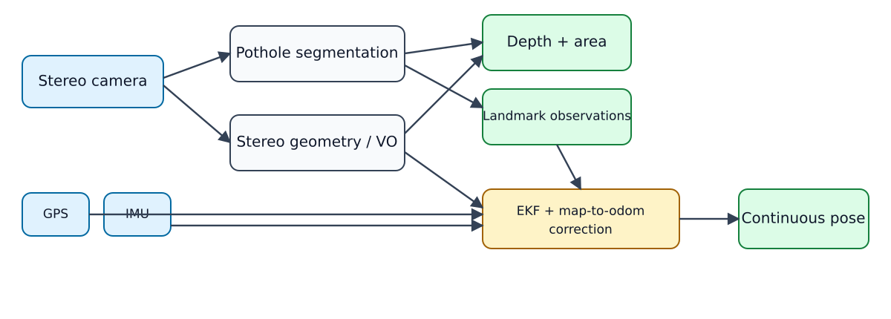

# Stereo pothole perception and GPS-degraded localization

[](https://github.com/khoa-na/pothole-gps-localization/actions/workflows/ci.yml)

CPU-oriented computer vision case study combining metric pothole geometry,
stereo visual odometry, GPS integrity monitoring, landmark re-identification,
and dual-frame EKF localization.

> This project originated as a time-boxed technical assessment and was later
> extended independently into a reproducible engineering case study. The
> company, original prompt, and any recruiting material are intentionally not
> identified or redistributed. The project uses public datasets and contains
> original implementation work plus attributed benchmark evidence.

[Benchmark notes](BENCHMARK.md) · [Model card](MODEL_CARD.md) ·
[Third-party notices](THIRD_PARTY_NOTICES.md) ·
[Demo videos](https://huggingface.co/datasets/khoa-na/pothole-gps-localization-demos)

The benchmark notes and the archived engineering report under
[`docs/archive/`](docs/archive/) are written in Vietnamese; this README is the
English entry point and links to the same machine-readable evidence.

## What is implemented

The repository contains two related but independently benchmarked stacks:

```text
Stereo camera
├── Pothole perception
│   ├── YOLO26n instance segmentation
│   ├── StereoSGBM road-disparity geometry
│   └── Depth, surface-area proxy, and uncalibrated severity triage
└── GPS-degraded localization
    ├── ORB stereo VO + optional IMU yaw
    ├── GPS integrity state machine and NIS gating
    ├── ORB keyframe place recognition + PnP verification
    └── dual-frame EKF: map → odom → base_link
```

The two stacks share the stereo sensor and CPU design budget, but there is not
yet one production runtime that schedules both stacks together. “Localization
throughput” therefore refers only to VO, fusion, U-turn detection, and landmark
queries; pothole perception is measured separately.



## Headline results

All claims below point to tracked machine-readable receipts. Known failures are
kept visible rather than removed from the portfolio.

| Capability | Result | Status |
|---|---:|---|
| Pothole box mAP@0.5, Pothole-600 evaluation split | 89.8% | Tracked ONNX |
| Pothole mask mAP@0.5 | 87.1% | Tracked ONNX |
| Box mAP@0.5, independent Mendeley video dataset | 38.5% | Domain gap |
| Stereo depth median error, 19 held-out pairs | 4.01% | Proxy pass |
| Stereo area median error | 11.23% | 16/19 within ±15% |
| Stereo pothole pipeline median throughput | 18.24 FPS | 25/27 pairs ≥15 FPS |
| VO drift over 500 m windows | 12/13 ≤5% | One 6.01% failure |
| Landmark retrieval Recall@1 | 0.708 | Below 0.85 target |
| Garage median error with landmarks | 8.62 m | Improved, still high |
| GPS handover detection | 13/13 events | Replay pass |
| Localization-stack throughput | 44.3 FPS | Excludes pothole and lane stacks |
| GPS re-lock below 5 m in 10 s | Not achieved | Open limitation |

Canonical receipts:

- Detection: `artifacts/portfolio-detection/a1.json`
- Independent-domain detection: `artifacts/portfolio-detection/cross-domain.json`
- Stereo depth/area: `artifacts/portfolio-stereo/benchmark.json`
- VO: `artifacts/vo-drift-final/benchmark.json`
- Landmark retrieval: `artifacts/landmark-reid/benchmark.json`
- Garage localization: `artifacts/garage-localization/benchmark.json`
- GPS fusion: `artifacts/gps-fusion-round5-vo/benchmark.json`
- Localization throughput: `artifacts/system-fps-b7/benchmark.json`

Stereo depth/area/FPS numbers above come from the most recent receipt run,
`artifacts/portfolio-stereo/` (4.01% depth, 11.23% area, 18.24 FPS). The
archived engineering report pins the earlier full-pipeline artifact
`artifacts/a3-grid/final-s03125-d112/` (4.97% depth, 11.61% area, 17.45 FPS),
captured before two later CPU optimizations, so that its accuracy, coverage,
and latency claims all trace to one artifact. Both receipts are tracked; the
difference is run-to-run provenance, not a correction.

## Quick start

Python 3.11 or newer is required. The current portfolio receipt was produced
with Python 3.14.4 on Linux x86-64.

This is a repository application, not a self-contained PyPI package. Clone it,
install the pinned requirements, and run the modules from the repository root;
datasets, receipts, documentation, and model provenance are intentionally kept
as repository-level assets.

```bash
python3 -m venv .venv
.venv/bin/pip install -r requirements.txt
```

Validate tracked receipts, documentation links, and model identity:

```bash
.venv/bin/python tools/validate_portfolio.py
```

Run a clone-ready CPU inference smoke test using the tracked ONNX model and a
synthetic image. This confirms loading and postprocessing; it is not an
accuracy demo.

```bash
.venv/bin/python -m demo.model_smoke
```

Run the dataset-free test suite:

```bash
.venv/bin/python -m pytest -q -s
```

## Model

- Path: `models/pothole_yolo26n_seg.onnx`
- Input: `1 × 3 × 512 × 512`
- Outputs: raw detections `1 × 37 × 5376`; prototypes `1 × 32 × 128 × 128`
- ONNX: opset 18, static input, raw one-to-many head
- Runtime: ONNX Runtime `CPUExecutionProvider`
- SHA-256: `3ab52bdc4b41cc59b4b845b090bcddc2d927870ce272fdcff2dbb473b3a598c5`
- License: AGPL-3.0; see [MODEL_CARD.md](MODEL_CARD.md)

The model was trained on Pothole-600 and PothRGBD. The Pothole-600 testing
split was consulted while comparing multiple exports/checkpoints, so this
repository calls it an **evaluation split**, not a pristine unseen test set.
The independent Mendeley result is the stronger generalization check.

The current accuracy receipts evaluate the exact tracked ONNX file on CPU.
The archived engineering report ([`docs/archive/REPORT.md`](docs/archive/REPORT.md))
retains earlier PyTorch-checkpoint results at `artifacts/verify-final/a1/` and
`artifacts/cross-dataset-pothole/` so its historical numbers remain
self-consistent.

Reproduce the two canonical accuracy receipts after preparing Pothole-600 and
downloading the Mendeley archive to the path documented by each CLI:

```bash
.venv/bin/python -m benchmarks.benchmark_a1_receipt
.venv/bin/python -m benchmarks.benchmark_cross_dataset_pothole
```

Rebuild the exact 1,008-image / 1,092-instance training manifest and run the
documented GPU recipe after downloading both datasets. The base checkpoint is
verified against the SHA-256 in `training/combined_recipe.yaml`:

```bash
.venv/bin/python -m training.train_pothole600 \
  --dataset .cache/data/pothole600 --prepare-only
.venv/bin/python -m data_tools.convert_pothrgbd_yoloseg \
  --dataset .cache/data/pothrgbd
.venv/bin/python -m data_tools.build_combined_seg_dataset
.venv/bin/python -m training.train_combined_detector \
  --data .cache/data/pothole600-pothrgbd-seg.yaml
```

## Pothole perception

The evaluated geometry path combines a YOLO segmentation mask with a robust
two-pass road-disparity fit. Stereo inputs must already be rectified and the
focal length/baseline must match the camera rig.

```bash
.venv/bin/python -m pipelines.stereo_yolo_pipeline \
  --detector models/pothole_yolo26n_seg.onnx \
  --left path/to/rectified_left.png \
  --right path/to/rectified_right.png \
  --focal 640.0 \
  --baseline-mm 120.0 \
  --output artifacts/stereo-yolo
```

Reproduce the tracked Fan-dataset receipt after downloading the dataset:

```bash
.venv/bin/python -m benchmarks.benchmark_stereo_yolo \
  --dataset .cache/data/fan-stereo-pothole \
  --detector models/pothole_yolo26n_seg.onnx \
  --output artifacts/portfolio-stereo
```

Depth Anything V2 remains a separate relative-depth baseline implemented by
`pipelines.depth_inference`. It is **not** an input accepted by
`PotholePipeline`, which expects the two-input ROI scalar depth regressor. The
final metric path uses stereo rather than monocular depth.

## GPS-degraded localization

The local filter tracks `[x, y, heading, velocity, yaw_rate]` in `odom`. GPS
and verified landmark positions update only `map → odom`, preserving local
pose continuity during GPS loss and recovery.

Main components:

- `pipelines/stereo_vo.py` — ORB stereo triangulation + temporal PnP.
- `pipelines/localization_ekf.py` — integrity state machine and dual-frame EKF.
- `pipelines/landmark_db.py` — pose prior, global descriptor, sequence score,
  and PnP verification.
- `data_tools/imu_yaw.py` — gated IMU yaw integration for replay.
- `ros2/localization_node.py` — offline-testable bridge plus a thin ROS2 node.

Run the bridge self-check without installing ROS2:

```bash
.venv/bin/python -m ros2.localization_node --self-check
```

The ROS2 file is an integration prototype, not a complete `colcon` package.
It currently exposes GPS GGA and visual-odometry inputs; landmark and IMU
runtime topics remain future integration work.

## Reproducing the localization benchmarks

Download and register for the required 4Seasons recordings first. Reference
poses are used only by offline evaluators, never by VO, EKF prediction, GPS
gating, or landmark association.

```bash
# VO drift
.venv/bin/python -m benchmarks.benchmark_vo_drift --no-render \
  --output artifacts/vo-drift-final

# Landmark retrieval, both traversal directions
.venv/bin/python -m benchmarks.benchmark_landmark_reid --reverse

# U-turn proxy
.venv/bin/python -m benchmarks.benchmark_uturn

# Garage localization and re-lock
.venv/bin/python -m benchmarks.benchmark_garage_localization

# GPS handover and re-lock
.venv/bin/python -m benchmarks.benchmark_gps_fusion

# Localization-stack CPU throughput
.venv/bin/python -m benchmarks.benchmark_system_fps
```

The complete sequential benchmark takes roughly 34 minutes on an i5-13400F
after the datasets have been downloaded.

## Data

Datasets are not committed. Local archives belong under `.cache/data/`.

| Dataset | Purpose | License/terms |
|---|---|---|
| Pothole-600 | Detector training and evaluation | MIT on the author-linked Kaggle data card |
| PothRGBD | Extra masks and ROI depth | MIT on dataset host |
| Fan stereo pothole | Stereo depth/area | MIT |
| Mendeley Pothole Videos v2 | Independent-domain evaluation | CC BY 4.0 |
| 4Seasons | VO/GPS/IMU/localization replay | CC BY-NC-SA 4.0; registration; non-commercial |

See [THIRD_PARTY_NOTICES.md](THIRD_PARTY_NOTICES.md) before redistributing
models, figures, benchmark evidence, or videos.

## Repository layout

```text
pipelines/    production-oriented perception and localization components
data_tools/   dataset loading, conversion, calibration, and audit utilities
training/     detector and ROI depth-regressor training
benchmarks/   machine-readable evaluation protocols
ros2/         offline bridge and ROS2 integration prototype
demo/         renderers and clone-ready model smoke test
tests/        dataset-free unit and integration tests
artifacts/    selected benchmark receipts and failure evidence
docs/         architecture diagrams, references, and archived planning notes
```

## Known limitations

- Cross-domain pothole accuracy is substantially below in-domain accuracy.
- Stereo depth/area uses only three physical potholes and proxy ground truth.
- Severity thresholds are heuristic and report `severity_calibrated=false`.
- The current stereo geometry stage selects one dominant residual component;
  robust multi-pothole association is future work.
- Landmark Recall@1 misses its target and absolute garage error remains high.
- GPS re-lock does not stabilize below 5 m within 10 seconds.
- Lane positioning is not implemented.
- Pothole perception and localization do not yet share one runtime scheduler.
- ROS2 runtime has not been validated on a physical vehicle.

## License

The repository is licensed under the GNU Affero General Public License v3.0
(`AGPL-3.0-only`). Third-party datasets, model components, figures, and demo
videos retain their own licenses; see [THIRD_PARTY_NOTICES.md](THIRD_PARTY_NOTICES.md).
