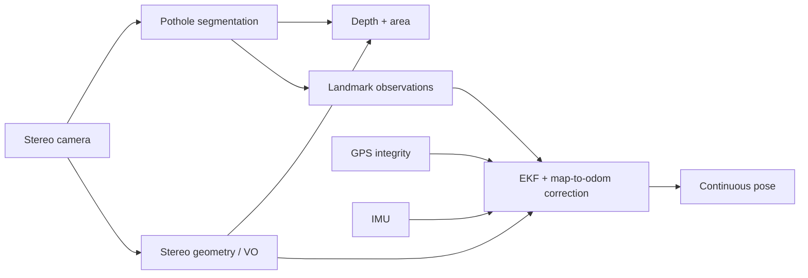
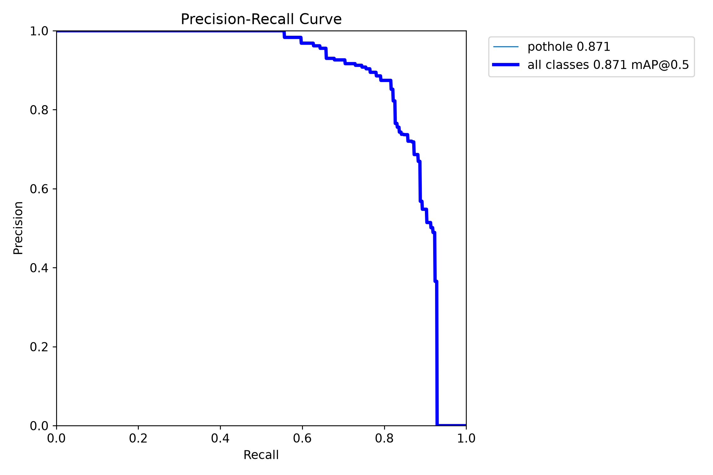
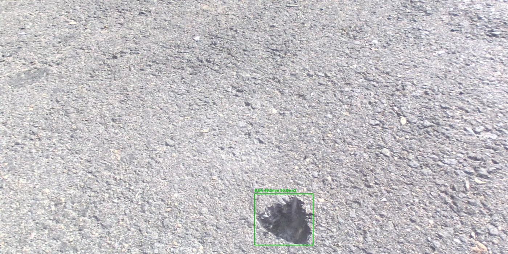
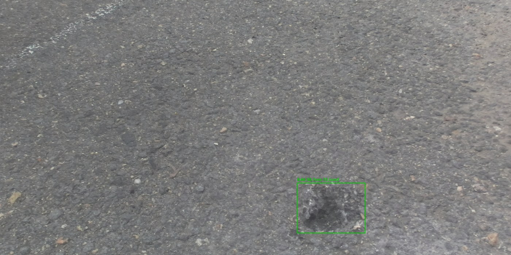
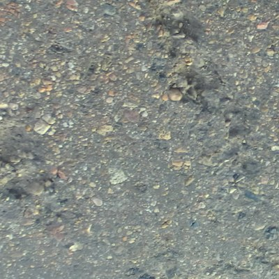
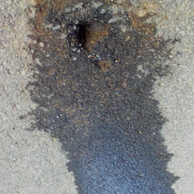
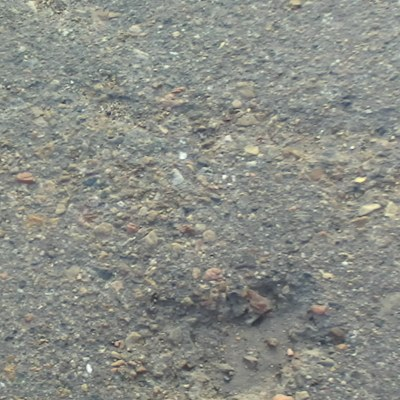
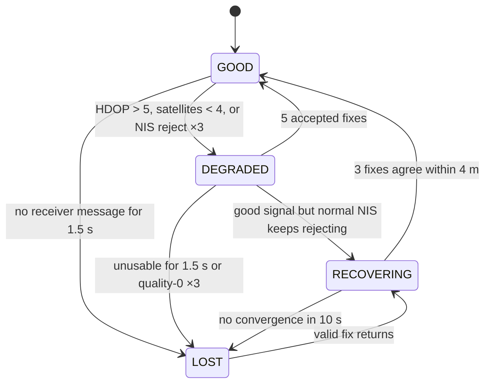

# Engineering Decision Report — Hệ thống Computer Vision cho xe điện

## Executive Summary

Trong ba ngày, tôi ưu tiên hai vertical slice có thể chạy và kiểm chứng trên
CPU thay vì cố triển khai đủ mọi nhánh của đề:

- **Phần A — phát hiện và đo ổ gà.** Detector segmentation đạt **86,2% box
  mAP@0.5 in-domain** và 34,0 FPS. Trên bộ dữ liệu độc lập chưa từng dùng khi
  phát triển, box mAP@0.5 còn **49,9%**; vì vậy 86,2% chỉ chứng minh khả năng
  trong miền Pothole-600, không chứng minh khả năng tổng quát hóa. Pipeline
  stereo đạt median depth error 4,97%, median area error 11,61% và 17,45 FPS
  trên proxy held-out 19 cặp ảnh.
- **Phần B — localization khi GPS suy giảm.** Theo metric trên 4Seasons replay,
  B1, B5, B6 và B7 đạt phạm vi thử nghiệm; B3 đạt latency trên garage proxy
  nhưng protocol còn điểm yếu. B2 landmark re-ID, B8 GPS re-lock và B4 lane
  position chưa đạt. Hệ thống giữ được quỹ đạo cục bộ liên tục khi GPS mất,
  nhưng độ chính xác tuyệt đối sau re-lock còn 17–26 m so với ngưỡng 5 m.
- **Giới hạn quyết định.** Geometry Phần A chỉ có ba ổ gà vật lý và dùng
  laser-derived proxy. Phần B là dataset replay, không phải field test trên xe
  thật. Demo minh họa hành vi; trạng thái KPI được quyết định bằng protocol,
  metric và artifact.

Kết quả đáng chú ý nhất không phải một KPI đẹp mà là hai failure đã đo được.
Landmark làm median error trong hầm giảm từ 14,66 m xuống 8,62 m dù map bị lệch
12,70 m. Ngược lại, GPS re-lock không thể đạt trong 2 s, và khi đo tách bạch
thì 4,47 s trong số đó là receiver chưa cấp nổi một fix nào — giới hạn phần
cứng, không phải lỗi bộ lọc. Hai kết quả này xác định đúng nơi cần đầu tư tiếp:
map consistency và covariance sau outage, không phải đổi EKF theo cảm tính.

## Scope & Trade-off

Bảng dưới là snapshot của artifact hiện có. Ước lượng còn lại dành cho một
người đã có code và dataset; không gồm thời gian chờ thu dữ liệu hoặc phần cứng.

| KPI | Trạng thái sau time-box | Bằng chứng chính | Ước lượng để đóng |
|---|---|---|---:|
| A1 — Detection mAP | **Đạt in-domain** | 86,2% trên Pothole-600 test; 49,9% trên bộ độc lập | 3–5 ngày để nâng cross-domain |
| A2 — Depth & area | **Đạt trên proxy** | Held-out 19 pair: median 4,97% depth, 11,61% area; chỉ 3 hố vật lý | 3–5 ngày mở rộng calibrated test |
| A3 — End-to-end FPS | **Đạt trên proxy** | Median 17,45 FPS; 26/27 pair ≥15 FPS, min 14,66 FPS | 0,5 ngày chốt run cuối |
| A4 — Failure analysis | **Đạt** | Hai failure geometry phân tích sâu, cộng FN/FP/mask-boundary xếp hạng theo IoU trên toàn split | Đã đóng |
| A5 — Đêm/mưa/nắng | **Chưa làm** | Không có condition-stratified test hoặc footage TP.HCM | 2–3 ngày + thu dữ liệu |
| B1 — VO drift / 500 m | **Đạt trên replay** | Median 2,40%; 12/13 cửa sổ ≤5% | 1–2 ngày truy failure 6,01% |
| B2 — Landmark re-ID | **Chưa đạt** | R@1 0,708 so với ngưỡng 0,85 | 2–4 ngày, phụ thuộc map drift |
| B3 — U-turn latency | **Đạt metric proxy** | Precision 1,000; recall 0,917/0,900; latency âm, nhưng có tích lũy góc từ cua trước | 1–2 ngày với U-turn đường phố |
| B4 — Lane position | **Không có code** | 4Seasons không có nhãn làn; 3/4 sequence không có vạch phù hợp | 1–3 ngày sau khi có dữ liệu |
| B5 — Garage localization | **Có quantitative proxy** | Median trong hầm 14,66 → 8,62 m khi bật landmark | 2–4 ngày để giảm absolute error |
| B6 — GPS handover | **Đạt trên replay** | 13/13 sự kiện phát hiện trong cùng chu kỳ NMEA | 0,5 ngày field validation |
| B7 — System FPS | **Đạt trên pipeline đã triển khai** | 44,3 FPS gồm VO, fusion, U-turn và landmark; chưa có lane | 0,5 ngày đo lại khi thêm module |
| B8 — GPS re-lock | **Chưa đạt** | 17–26 m sau 2 s; không cấu hình nào ổn định dưới 5 m trong 10 s | 2–4 ngày sửa recovery policy |

Việc hoãn A5 và B4 là quyết định dữ liệu, không phải quyết định thuật toán.
Không có ground truth phù hợp thì một con số tự gán nhãn sẽ làm report trông
đầy hơn nhưng không làm bằng chứng mạnh hơn.

## Evaluation Protocol

### Phần A

- **Detection in-domain:** Pothole-600 official test, 180 ảnh / 196 instance.
  Checkpoint chọn bằng validation; test không tham gia gradient update nhưng đã
  được xem qua nhiều lần so sánh export/checkpoint, nên không được gọi là test
  hoàn toàn chưa quan sát.
- **Cross-domain:** Mendeley `5bwfg4v4cd` test split, 123 clip, 1.476 frame và
  1.532 instance. Cùng `YOLO.val()` và `imgsz=512` như phép đo in-domain.
- **Depth và area:** Fan stereo pothole, 27 pair / 3 hố vật lý. `model1` dùng
  calibration; 19 pair của `model2/model3` held-out. Depth GT là laser
  z-extent proxy; area GT là laser XY convex-hull proxy.
- **CPU:** i5-13400F, batch 1. Detector đo bằng ONNX Runtime CPU ở 512×512.
  Stereo benchmark gồm detection, SGBM, road-plane fit, fusion và geometry.

Để không trộn số từ các lần tối ưu khác nhau, A2/A3 trong report dùng cùng một
artifact full-pipeline `artifacts/a3-grid/final-s03125-d112/`: 4,97% depth,
11,61% area và 17,45 FPS. Các số mới hơn chỉ được thay vào report khi một
artifact cuối lưu đồng thời accuracy, coverage và latency.

### Phần B

- Dataset 4Seasons gồm `office_loop_1`, `neighborhood_4`, `garage_2` và
  `garage_3`. Stereo, IMU và NMEA được replay theo timestamp.
- Reference trajectory chỉ dùng để gán nhãn và chấm offline; không được đưa vào
  Stereo VO, EKF hoặc landmark association khi chạy.
- B1 đo SE(2) đầu–cuối trên các cửa sổ 500 m không chồng lấn, không fit scale.
- B2 dựng database từ `garage_3`, query bằng `garage_2`; chiều này được chốt
  trước khi xem recall. B5 dùng cùng đoạn hầm 50,4 s, chốt bằng exposure và ảnh
  biên, không trim theo error.
- B6/B8 dùng NMEA thật. GPS mô phỏng chỉ kiểm state transition, không thay bằng
  chứng receiver thật. B7 dùng throughput = số frame / tổng thời gian và gồm
  landmark ở nhịp keyframe.

Mọi metric headline đều có JSON do script sinh, gồm cả detector: receipt A1 ở
`artifacts/verify-final/a1/benchmark.json` ghi model SHA, split, phiên bản
Ultralytics/ONNX Runtime/torch, cấu hình chạy và metric. Việc dựng receipt này
đã làm lộ một sai lệch so với bản nháp trước — xem mục detector. Video và ảnh
minh họa không tham gia tính KPI.

## System Decision Frame

Hai phần dùng chung stereo camera và cùng tranh chấp ngân sách CPU:



Chiến lược là khóa các vertical slice có thể kiểm chứng và giữ interface ổn
định. Một tối ưu cục bộ chỉ được nhận nếu không làm xấu downstream accuracy,
continuity hoặc throughput.

## Phần A — Pothole Detection and Geometry

### Quyết định kỹ thuật

Pipeline production dùng **YOLO26n-seg → ONNX raw head → StereoSGBM →
road-disparity plane → mask–geometry fusion**.

Segmentation được chọn thay box-only vì area phụ thuộc trực tiếp vào biên mask.
Stereo được chọn thay monocular vì Phần A cần metric depth; Depth Anything V2
nhanh nhưng không đạt A2 trên PothRGBD. Detector và stereo chạy sequential vì
chạy song song trên i5-13400F làm ONNX Runtime và OpenCV tranh core, khiến
throughput giảm dù CPU utilization tăng.

Model production:

```text
models/pothole_yolo26n_seg.onnx
input: 1×3×512×512
outputs: detections 1×37×5376; mask prototypes 1×32×128×128
size: 11,006,894 bytes
sha256: 3ab52bdc4b41cc59b4b845b090bcddc2d927870ce272fdcff2dbb473b3a598c5
```

### Detector: đạt in-domain, chưa tổng quát hóa

| Metric | Pothole-600 test | Bộ độc lập |
|---|---:|---:|
| Box precision | 92,5% | 62,1% |
| Box recall | 78,6% | 50,1% |
| Box mAP@0.5 | **86,2%** | **49,9%** |
| Box mAP@0.5:0.95 | 53,4% | 26,3% |
| Mask mAP@0.5 | **84,6%** | **45,4%** |
| Mask mAP@0.5:0.95 | 50,8% | 21,2% |

KPI A1 đạt trong miền Pothole-600 nhưng trượt mạnh khi đổi miền. Trên bộ độc
lập, recall thấp hơn precision: model bỏ sót nhiều hơn báo nhầm. Đây là rủi ro
deployment lớn hơn chênh lệch vài điểm giữa các checkpoint in-domain.

**Vì sao con số này thấp hơn 89,8% từng được báo.** Bản nháp trước của report
trích 89,8% box và 87,1% mask, lấy từ dòng "ONNX merged" trong `BENCHMARK.md`.
Lần chạy đó chỉ để lại PNG — không có file nào ghi model SHA, split, phiên bản
thư viện hay cấu hình. Khi dựng receipt máy đọc được
(`artifacts/verify-final/a1/benchmark.json`), checkpoint đo lại ra **86,2%**.

Kiểm tra tiếp cho thấy con số cũ không tái lập được bằng bất kỳ đường nào còn
chạy được. Gọi thẳng `YOLO.val()` lên `models/pothole_yolo26n_seg.onnx` trả về
**toàn số 0** và báo `DetMetrics` thay vì `SegMetrics`, vì đó là raw head
export (`end2end=False`) mà phần decode nằm ngoài ONNX graph, trong
`pothole_pipeline`. Nói cách khác, đường đo sinh ra 89,8% không còn tồn tại
dưới dạng script chạy được.

Chính `BENCHMARK.md` cũng ủng hộ số thấp hơn: dòng "PyTorch baseline,
end2end=False" ghi 86,9%, sát với 86,2% đo được ở đây.

Report dùng **86,2%** vì đó là con số duy nhất bảo vệ được. KPI không đổi hạng —
86,2% vẫn vượt ngưỡng đạt 80% và ngưỡng xuất sắc 85%. Thứ đổi là con số ấy giờ
có receipt đi kèm.

Production recipe cao hơn baseline Pothole-600-only 4,3 điểm phần trăm box
mAP@0.5 và 5,9 điểm mask mAP@0.5. Tuy nhiên đây không phải ablation chỉ thay
dataset: production đồng thời đổi epoch, cosine learning rate và copy-paste.
Report chỉ kết luận toàn recipe tốt hơn, không gán toàn bộ gain cho PothRGBD.



Detector latency do Ultralytics báo là 0,4 ms preprocess, 25,7 ms inference và
3,3 ms postprocess, tổng 29,4 ms / 34,0 FPS. Lần chạy này không lưu phân phối
từng ảnh, nên report không gọi đó là median hoặc p95.

### Stereo depth và area

| Metric held-out, 19 pair | Kết quả |
|---|---:|
| Detection / fusion coverage | 100% / 100% |
| Median depth error | **4,97%** |
| Depth trong ±15% | 100% |
| Median area error | **11,61%** |
| Area trong ±15% | 89,47% |
| Depth và area cùng trong ±15% | 89,47% |
| Median end-to-end FPS | **17,45** |
| Pair đạt ≥15 FPS | 26/27 |

Depth đạt ngưỡng trên proxy, nhưng area không đạt ở mọi mẫu. Vì chỉ có ba hố
vật lý, kết quả này chứng minh pipeline hoạt động và chỉ ra failure mode; nó
không đủ để ước lượng generalization cho mặt đường thật.

### Decision record

| Hướng | Kết quả quan sát | Quyết định |
|---|---|---|
| Box-only detector | Có thể đạt A1 nhưng không có biên area | Loại |
| Depth Anything V2 | Đủ nhanh ở input nhỏ nhưng depth error vượt 15% | Giữ làm baseline, không production |
| Fine-tune giai đoạn 2 | Box mAP@0.5 90,2% nhưng mAP@0.5:0.95 và stereo coverage giảm | Loại |
| ONNX end-to-end top-300 | Box/mask mAP@0.5 còn 74,1%/71,9% | Loại |
| INT8 QDQ | Session nhanh hơn nhưng area trong ±15% giảm 78,9% → 68,4% | Loại |
| YOLO mask + StereoSGBM | Đạt A1, metric depth và CPU budget tốt nhất trong các cấu hình đã đo | **Chọn** |

### Failure analysis A1–A2 — mask boundary làm hỏng area

#### Case A1 — `model1/L8`: area over-estimate 25,08%



Depth error chỉ 2,70%, detector confidence 0,843 và fusion không fallback,
nhưng area error là 25,08%. Giả thuyết phù hợp nhất là mask lấy cả vành tối
quanh miệng hố trong khi GT là laser convex-hull proxy. Một global scale không
sửa được vì bias đổi theo hố và viewpoint. Thí nghiệm tiếp theo cần tách
opening-mask error khỏi back-projection error trên calibration split riêng.

#### Case A2 — `model2/L20`: held-out area error 21,68%



Đây là held-out group; depth error 4,09% nhưng area error 21,68%. Ca này bác bỏ
giả thuyết “depth chính xác thì area tự đạt”. Hệ số `yolo_area_scale=0,9096`
từng làm median đẹp hơn nhưng kéo xấu p95 và tỷ lệ trong ±15%, nên bị loại.
Hướng sửa rẻ nhất là đo area từ giao giữa semantic mask và stereo residual,
sau đó chấm trên nhiều hố vật lý hơn.

### Failure analysis A3 — detector bỏ sót nhiều hơn báo nhầm

Hai ca trên là lỗi hình học. Lỗi của chính detector được lấy bằng cách xếp hạng
IoU trên **toàn bộ** 180 ảnh test thay vì lấy ba batch đầu — ba batch đầu tình
cờ đều là ca thành công, và chọn từ đó rồi gọi là failure analysis thì không
trung thực.

Trên Pothole-600 test: **30 ảnh** chứa ít nhất một false negative và **36 ảnh**
chứa ít nhất một false positive, ở ngưỡng confidence 0,25 và IoU khớp 0,5.

| False negative | False positive | Biên mask tệ nhất |
|---|---|---|
|  |  |  |
| `0111.png` — GT có ổ gà, detector không báo | `0050.png` — detector báo, GT không có | `0144.png` — khớp đúng ca nhưng biên lệch |

Cả ba do `benchmarks/benchmark_a1_receipt.py` chọn tự động bằng thứ hạng IoU,
không phải tôi nhặt tay.

Tỷ lệ này khớp với recall box 78,6% in-domain và tụt còn 50,1% cross-domain:
kiểu lỗi trội của model là **bỏ sót**, không phải báo nhầm. Với cảnh báo lái
xe, bỏ sót là kiểu lỗi nguy hiểm hơn — nó không làm phiền người dùng nên cũng
không tự lộ ra khi chạy thật.

## Phần B — GPS-Degraded Localization

### Quyết định kiến trúc

Hệ thống dùng **EKF hai frame**:

- VO và IMU tích lũy trong `odom→base_link`; GPS không sửa trực tiếp local pose.
- GPS và landmark chỉ cập nhật `map→odom` qua cùng một
  `update_position(position, covariance, gate=True)` hook.
- Khi GPS suy giảm, local trajectory tiếp tục chạy; khi GPS trở lại, correction
  được phân bổ ở global transform thay vì kéo giật odometry.

Thiết kế này giải thích B6: handover không khởi tạo lại bộ lọc mà chỉ thay đổi
độ tin cậy của một nhánh correction đã tách sẵn.



### Trình tự khi mất GPS

1. Integrity monitor hạ trạng thái ngay khi HDOP >5, satellite <4 hoặc fix
   quality bằng 0; ba quality-0 liên tiếp mới xác nhận LOST.
2. Pose WGS84/global cuối có covariance thấp được latch làm anchor.
3. Nhánh correction `map→odom` giảm trọng số; local EKF không reset.
4. Stereo VO cấp translation, IMU yaw được dùng khi cổng hiệu chỉnh bias đạt.
5. Landmark observation hợp lệ cập nhật global position qua NIS gate.
6. Khi fix trở lại, hệ vào RECOVERING; correction chỉ được nhận sau consensus,
   rồi áp vào `map→odom`.

### Kết quả B1–B8

| KPI | Kết quả | Kết luận đúng phạm vi |
|---|---|---|
| B1 — VO drift | Median 2,40%; 12/13 cửa sổ ≤5% | Đạt replay; một failure 6,01% |
| B2 — Landmark re-ID | R@1 0,708; R@5 0,811; precision 0,966 | Chưa đạt recall 0,85 |
| B3 — U-turn | Precision 1,000; recall 0,917/0,900; median −2,18/−2,61 s | Pass metric garage proxy; chưa chứng minh U-turn đường phố |
| B4 — Lane | Không có code hoặc labeled test | Chưa làm |
| B5 — Garage | Median trong hầm 14,66 → 8,62 m khi bật landmark | Có quantitative proxy; absolute error còn cao |
| B6 — Handover | 13/13 event trong cùng NMEA cycle | Đạt replay; chưa field-validated |
| B7 — FPS | 44,3 FPS throughput | Đạt cho pipeline đã triển khai, chưa có lane |
| B8 — Re-lock | 17,46–26,04 m sau 2 s; không ổn định <5 m trong 10 s | Chưa đạt |

### B1 — VO đạt phần lớn cửa sổ, chưa rõ failure còn lại

B1 đo trên 13 cửa sổ 500 m không chồng lấn qua bốn sequence, không fit scale.
Failure duy nhất là `office_loop_1` window 1 tại 6,01%. Nó có rotation drift
thấp nhất dãy, 0,109°/100 m, nên lỗi chủ yếu là translation. Tương quan giữa
drift và quãng đường mỗi frame chỉ 0,213; giả thuyết “chạy nhanh làm scale
trôi” không được dữ liệu ủng hộ. Nguyên nhân chưa xác định.

### Failure case B-1 — Map offset làm B2 trượt

| Đại lượng | Median | Ý nghĩa |
|---|---:|---|
| Association error | **1,28 m** | Sai số giữa nhãn database entry và query trong cùng label frame |
| DB frame offset | **12,70 m** | Sai số global của EKF tại thời điểm dựng map |

Matcher có precision 0,966 và association error thấp, nhưng map offset vượt
spatial prior. Vì vậy 241/393 query phải quét toàn database. Chạy chiều ngược
lại cho kết quả gần giống, loại trừ bug frame một chiều.

Một giả thuyết ban đầu cho rằng `garage_3` mất IMU yaw vì cổng gyro quá chặt,
từ đó gây map drift. Phản chứng cho thấy ép mở cổng làm rotation drift tăng từ
2,422 lên 18,807°/100 m và translation drift từ 1,74% lên 8,38%. Lấy lại bias
hợp lý chỉ cải thiện rotation drift khoảng 9%. Kết luận được phép rút ra là:
map drift có thật và làm chết prior; nguyên nhân gốc vẫn chưa xác định. Đổi
descriptor trước khi sửa map consistency sẽ tối ưu sai chỗ.

### Failure case B-2 — Cửa sổ quay đầu làm B3 báo sớm

| Sequence | TP / FP / FN | Recall | Latency median |
|---|---:|---:|---:|
| `garage_2` | 11 / 0 / 1 | 0,917 | −2,18 s |
| `garage_3` | 9 / 0 / 1 | 0,900 | −2,61 s |

Latency âm nghĩa là detector báo trước khi khúc quay được gán nhãn kết thúc.
Tuy nhiên cửa sổ tích lũy 8 s dài hơn khoảng cách trung vị 3,5 s giữa các cua
trong garage. Ở `garage_2`, 9/11 detection kích hoạt khi khúc quay đang xét
chưa đạt 150°; thấp nhất chỉ 67,1°. Vì vậy metric latency đạt, nhưng bằng chứng
về U-turn đường phố còn yếu. Ngưỡng không được chỉnh sau khi thấy kết quả;
failure được giữ lại trong artifact.

### B5 và failure case B-3 — Landmark giúp trong hầm, re-lock vẫn thất bại

Ba cấu hình dùng cùng segment 50,4 s:

| Cấu hình | Median trong hầm | p95 | Sai số sau re-lock 2 s |
|---|---:|---:|---:|
| A — không landmark | 14,66 m | 34,53 m | 17,46 m |
| B — có landmark | **8,62 m** | 21,97 m | 26,04 m |
| C — có landmark, cắt GPS dưới mái | **6,23 m** | 23,12 m | 24,39 m |

Landmark giảm error trong hầm dù map lệch vì một anchor lệch tương đối ổn định
vẫn tốt hơn dead reckoning trôi tự do. Cấu hình C tốt hơn B cho thấy GPS đa
đường dưới mái có thể gây hại hơn không có GPS; HDOP và số vệ tinh chưa đủ để
phát hiện kiểu lỗi này.

Nhưng cả ba cấu hình đều trượt B8. `consensus_achieved` xuất hiện **8,67 s sau
khi ra khỏi mái** ở cả A/B/C, giống nhau đến hai chữ số thập phân dù bật hay
tắt landmark, dù GPS thật hay bị cắt.

Kết luận đầu tiên của tôi là đổ lỗi cho cổng consensus và đề xuất nới
`recovery_consensus_count`/`radius`. Quét thẳng hai tham số đó cho thấy đề xuất
sai:

| Cấu hình | `consensus_achieved` | Sai số sau 2 s |
|---|---:|---:|
| count 3, radius 4 m (nộp bài) | 8,67 s | 17,46 m |
| count 2, radius 4 m | 8,57 s | 17,46 m |
| count 1, radius 4 m | **8,47 s** | 17,46 m |
| count 3, radius 8 m | 8,67 s | 17,46 m |
| count 1, radius 8 m | 8,47 s | 17,46 m |

Hạ từ ba fix xuống một fix chỉ tiết kiệm **0,20 s**. Nới bán kính gấp đôi tiết
kiệm **0 s**. Sai số sau 2 s không nhúc nhích ở bất kỳ cấu hình nào.

Đọc thẳng luồng NMEA thô giải thích tại sao. Sau khi ra khỏi mái, receiver
không cấp **một fix dùng được nào** cho tới **+4,47 s** — trước đó là
`fix_quality=0`, 0 vệ tinh. Từ +4,47 s trở đi fix về đều đặn mỗi 0,1 s với chất
lượng tốt: quality 1, 8 vệ tinh, HDOP 1,5.

Vậy 8,67 s chia thành ba phần rất khác nhau:

| Giai đoạn | Thời gian | Bản chất |
|---|---:|---|
| Receiver không có fix nào | **4,47 s** | Vật lý tái bắt vệ tinh, phần mềm không chạm tới được |
| Fix tốt đã về nhưng bị cổng từ chối | **~4,0 s** | EKF đã trôi hơn 17 m nên fix đúng trông như outlier với NIS |
| Yêu cầu ba fix đồng thuận | **0,20 s** | Phần duy nhất mà việc nới consensus đụng tới |

Cổng consensus chiếm **2,3%** ngân sách. Khuyến nghị nới nó gần như vô nghĩa.

Hai giai đoạn thật sự cần xử lý hoàn toàn khác nhau. Giai đoạn 4,47 s là giới
hạn phần cứng — chỉ giải được bằng receiver tái bắt nhanh hơn hoặc assisted
GNSS, không giải được bằng code. Giai đoạn 4,0 s mới là lỗi phần mềm thật, và
nó nằm ở chỗ khác hẳn nơi tôi đoán: sau outage dài, covariance của bộ lọc phải
được nới đủ để fix hợp lệ quay về vẫn qua được cổng NIS. Bộ lọc đang quá tự tin
vào một vị trí sai.

Điều này cũng nâng giá trị của landmark ở B5. Nếu 4,47 s đầu là bất khả kháng,
thì thứ duy nhất có thể bắc cầu qua quãng đó là visual correction — chính là
thứ đã kéo median trong hầm từ 14,66 m xuống 8,62 m.

### B6 và B7 — continuity và CPU budget

Handover được log 0,00 s vì state thay đổi trong cùng callback NMEA và local
EKF không reset. Cách diễn đạt chính xác là **dưới một chu kỳ NMEA**, không
phải độ trễ vật lý bằng tuyệt đối 0.

B7 dùng throughput, không dùng median frame latency, vì landmark chỉ chạy trên
khoảng 8% frame. Với 8 OpenCV threads, pipeline VO + fusion + U-turn +
landmark đạt 44,3 FPS; landmark tốn median 43,1 ms mỗi query nhưng chỉ 3,41 ms
amortized mỗi frame. Con số này chưa gồm lane module vì B4 chưa được triển khai.

Phân rã từng tầng cho thấy ngân sách CPU nằm ở đâu, 600 frame, 8 threads:

| Tầng | Median | p95 | Max |
|---|---:|---:|---:|
| Đọc ảnh từ đĩa | 4,43 ms | 5,21 ms | 6,70 ms |
| **Stereo VO** | **17,88 ms** | 33,89 ms | 47,57 ms |
| Fusion + event detection | 0,14 ms | 0,28 ms | 6,79 ms |
| Landmark | 0,01 ms | 39,72 ms | 53,40 ms |
| Tổng, gồm đọc đĩa | 23,02 ms | 62,17 ms | 79,25 ms |

Ba điều rút ra, và chúng định hướng việc tối ưu tiếp theo.

**Stereo VO chiếm gần 80% ngân sách xử lý.** Muốn nhanh hơn phải động vào VO,
không phải tối ưu EKF. Đây cũng là lập luận định lượng ủng hộ hướng mono VIO
trong bảng phương án bị loại: bỏ stereo matching là bỏ đúng tầng đắt nhất.

**Fusion và event detection gần như miễn phí** ở 0,14 ms. Toàn bộ EKF, GPS
integrity state machine và U-turn detection cộng lại rẻ hơn việc đọc một ảnh
từ đĩa 30 lần. Thêm module logic vào tầng này gần như không tốn gì.

**Landmark có median 0,01 ms nhưng p95 tới 39,72 ms.** Phân phối hai đỉnh:
92% frame không truy vấn nên tốn 0, còn 8% frame còn lại tốn ~43 ms. Đây chính
là lý do headline phải là throughput — median frame không mang chi phí landmark
và sẽ cho một con số đẹp nhưng sai. Với ứng dụng cần latency ổn định thay vì
throughput, tầng landmark nên được đẩy sang luồng riêng.

Đọc ảnh từ đĩa 4,43 ms là chi phí của replay, không có trên xe thật nơi frame
đến thẳng từ camera. Loại nó ra thì pipeline median còn 54,1 FPS.

### Rủi ro vận hành

- **Timestamp:** stereo, IMU và NMEA có ba clock; lệch pha có thể trông giống
  VO drift. Dataset replay không thay validation đồng bộ trên xe.
- **IMU bias:** calibration cần một đoạn đứng yên thật. Cổng hiện tại bảo vệ
  hệ khi điều kiện đó không tồn tại, nhưng cũng làm IMU yaw không khả dụng.
- **Feature dropout:** 4Seasons chỉ có khoảng 0,6–1,0% dropout; xe điện rung
  trên đường Việt Nam có thể cao hơn.
- **Map consistency:** landmark đúng trong label frame vẫn có thể kéo pose sai
  nếu database được dựng từ global pose bị drift.
- **Low light và lane:** chưa có test condition-stratified hoặc lane GT, nên
  không có cơ sở claim S1/B4.

### Decision record Phần B

| Hướng | Đánh đổi | Quyết định |
|---|---|---|
| Stereo VO | Có absolute scale; tái dùng camera Phần A; tốn CPU | **Chọn** |
| Mono VIO + CAN/wheel odometry | Có thể rẻ CPU hơn nhưng 4Seasons không có CAN để kiểm | Hoãn tới xe thật |
| ORB-SLAM3 / VINS-Fusion | Có loop closure nhưng integration/tuning vượt time-box | Loại trong prototype |
| EKF loosely coupled hai frame | Giữ local continuity, dễ cô lập GPS/landmark failure | **Chọn** |
| Factor graph / pose graph | Phù hợp sửa map drift hồi tố | Hướng nâng cấp cho B2 |
| Descriptor học sâu | Có thể tăng retrieval nhưng không sửa DB frame offset | Không ưu tiên trước map consistency |

## Demo Protocol

Ba video **nộp kèm ngoài repo** vì tổng dung lượng 210 MB. Script render nằm
trong `demo/`, chạy lại được từ dataset.

| Video | Kích thước | Nội dung | KPI minh họa | Nguồn |
|---|---|---|---|---|
| `part_a.mp4` | 1280×802, 64,8 s | 27 stereo pair, depth/area cạnh GT, đánh dấu calibration/held-out | A2/A3 | Fan stereo pothole |
| `part_a_video.mp4` | 720×858, 40,0 s | 20 clip liên tục lấy theo thứ tự, prediction chồng GT | A1/A4 cross-domain | Mendeley `5bwfg4v4cd` |
| `part_b.mp4` | 1200×542, 182,9 s | Camera + top-view trajectory + GPS state + U-turn event | B1/B3/B6 | 4Seasons `garage_2` |

Các video đều render từ dataset công khai và có banner nguồn. Không video nào
được trình bày như footage tự quay tại TP.HCM. `part_a.mp4` lặp ảnh tĩnh vì bộ
Fan không có video; `part_a_video.mp4` tồn tại để cho thấy hành vi trên chuỗi
liên tục và không chọn clip theo kết quả.

## Nếu tiếp tục thêm hai tuần

**Tuần đầu — sửa hai failure đã định vị.**

1. Với B8, sweep consensus đã chạy và loại trừ recovery policy: nới count và
   radius chỉ mua được 0,20 s trên tổng 8,67 s. Việc còn lại là giai đoạn 4,0 s
   mà fix tốt bị cổng NIS từ chối — cần cho covariance nở đúng mức trong outage
   dài, rồi đo lại time-to-stable và tỉ lệ false re-lock trên held-out NMEA.
   Giai đoạn 4,47 s đầu là receiver, phải giải bằng phần cứng hoặc assisted GNSS.
2. Với B2, truy nguyên map drift bằng image-quality/feature diagnostics và
   cross-traversal registration. Chỉ đổi descriptor sau khi spatial prior hoạt
   động đúng.
3. Chốt một artifact A2/A3 duy nhất chứa accuracy, coverage, p50/p95 latency,
   config và model SHA để đồng bộ report với README.

**Tuần hai — mở rộng bằng chứng.**

1. Mở rộng calibrated stereo test vượt ba hố vật lý và thêm opening-mask GT.
2. Fine-tune/evaluate detector trên dữ liệu mặt đường Việt Nam để xử lý khoảng
   cách 86,2% in-domain và 49,9% cross-domain.
3. Thu hoặc dùng dataset có ego-lane GT cho B4 và có condition labels cho A5.
4. Chạy field test timestamp, vibration, GPS multipath và ROS 2 runtime trên
   phần cứng đích.

## References Used in the Decision

1. Rui Fan, Hengli Wang, Mohammud J. Bocus, Ming Liu. [*We Learn Better Road
   Pothole Detection: from Attention Aggregation to Adversarial Domain
   Adaptation*](https://arxiv.org/abs/2008.06840), ECCV Workshops, 2020.
2. Deeksha Arya et al. [*RDD2022: A multi-national image dataset for automatic
   Road Damage Detection*](https://arxiv.org/abs/2209.08538), 2022.
3. Patrick Wenzel et al. [*4Seasons: A Cross-Season Dataset for Multi-Weather
   SLAM in Autonomous Driving*](https://arxiv.org/abs/2009.06364), GCPR, 2020.
4. Pothole video dataset for semantic segmentation,
   [Mendeley Data `5bwfg4v4cd` v2](https://data.mendeley.com/datasets/5bwfg4v4cd/2),
   CC BY 4.0.
5. Carlos Campos et al. [*ORB-SLAM3: An Accurate Open-Source Library for
   Visual, Visual-Inertial, and Multi-Map SLAM*](https://arxiv.org/abs/2007.11898),
   T-RO, 2021.
6. Nikhil Keetha et al. [*AnyLoc: Towards Universal Visual Place
   Recognition*](https://arxiv.org/abs/2308.00688), RA-L, 2024.
